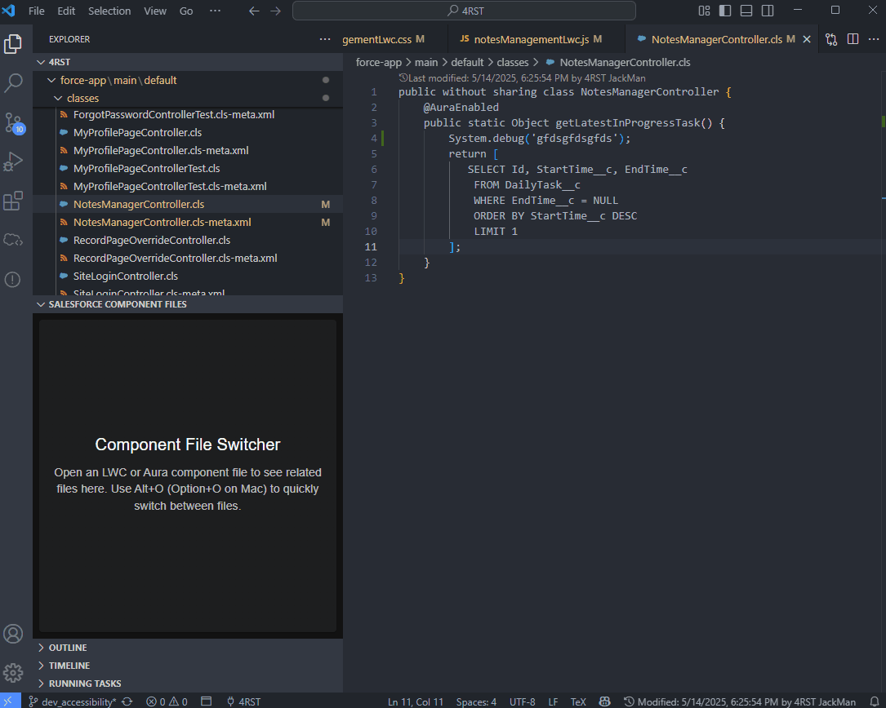

# ✨ Salesforce Multitools - Level Up Your SF Dev Game! ✨

This VS Code extension boosts your productivity and streamlines your Salesforce development workflow. 😎

## 🔥 Features Overview 🔥

### 🚀 Component File Switcher

Tired of clicking through folders to find your Lightning component files? We fixed that!

- **Keyboard Shortcut**: Use `Alt+O` (or `Option+O` on Mac) for quick access
- **Sidebar UI**: View all your component files in one spot, no scrolling needed

When you're working with Lightning components:

1. Press `Alt+O` (or `Option+O` on Mac) to activate
2. Files appear based on the hierarchy (prioritizing the important ones):
    - For LWC: JS file is the primary file, followed by HTML & CSS
    - For Aura: Controller.js takes priority, then the component file & CSS

The sidebar provides a clean interface with:
- Component name & type with LWC/Aura indicators
- Files grouped by type for better organization
- Unsaved files get a special indicator
- Current file is highlighted for easy reference

### 👀 Last Modified Details

See who modified your code last and when, get notified and blame them!
- Track who last modified each Salesforce component 
- Displays timestamps of when changes were made
- Integrates with CodeLens for in-line visibility
- Automatic refresh at configurable intervals

### 🔍 Debug Log Fetcher

Fetch and analyze Salesforce debug logs with enhanced filtering and UI:
- **Command**: Use `Salesforce Multitool: Open Debug Logs` or from the Command Palette (`Ctrl+Shift+P` / `Cmd+Shift+P`)
- User-specific log filtering with typeahead search
- Interactive log viewer with method name tracking
- Responsive table with tooltips and optimized layout
- One-click download and open in VS Code

## 🔮 Coming Soon! 🔮

- **Salesforce Constantinator** - Convert hardcoded strings into constants

## 💯 Requirements

- VS Code 1.90.0+
- Salesforce CLI

## 🤓 Installation 🤓

Available from the VS Code Marketplace or download the VSIX file from releases.

## 🛠️ Want to Contribute? 🛠️

### Build from source:

1. Clone the repo
2. `npm install` to get dependencies
3. `npm run compile` to build
4. Press F5 to start debugging

---

_This extension was built to make Salesforce development more efficient and enjoyable. Thanks for checking it out!_
